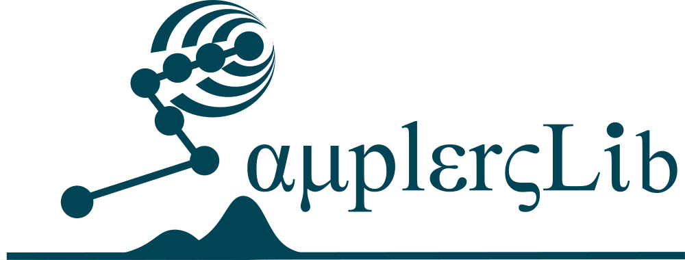

# SamplersLib
An open-source, data-driven framework for data generation that accelerates the optimization process by rapidly converging towards better incumbent solutions.

# License & copyright
© Ahmed H. Bayoumy 2024-2026

This program is free software: you can redistribute it and/or modify it under the terms of the GNU General Public License either version 3 of the License, or (at your option) any later version.

See the [LICENSE](LICENSE) file for the full license text.
